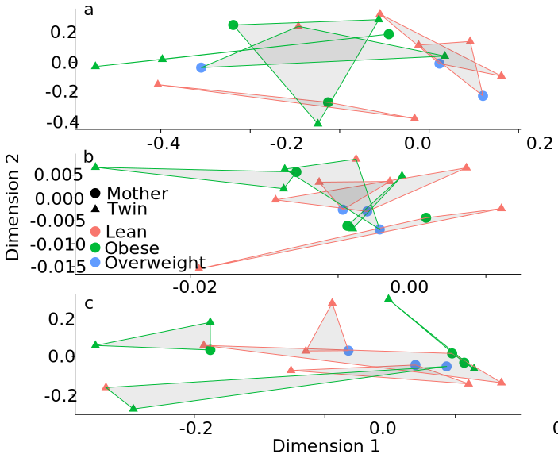

## What:

Operational protein families are clusters of similar proteins

Creating OPFs is a database free method of grouping sequences analogous to OTUs

## Why:

Databases are not great

* Genes present are limited to what we "know" or at least have seen before
* Annotations are limited in the same way
* Leaves a large (often over half) of the data in a black box

--- .class #id

## How to make OPFs

### Quickly:

1. Assemble
1. Gene prediction
1. Get counts
1. All v all BLAST
1. Cluster

--- &twocol

## Assemble

*** =left
### Iterative velvet

1. Assemble with a high k value
1. Enable read tracking and save unused reads
1. Assemble unused reads at a lower k value
1. Repeat


*** =right
### Megahit

* Runs an iterative assembly by default, small k to large
* Much faster than iterative velvet
* Yes, I know I'm mixing numbers and bullets.

---

## Gene prediction

### Metagene annotator (MGA)

* Gene prediction models for Bacteria, Archaea and Phage
* Uses ribosomal binding site patterns as predictors for domain
* Optimized for short fragments
    - uses 700bp fragment as example
    - similar to contig sizes seen after assembly

---

## Estimate gene counts

Map reads with bowtie for short reads, bwa for long reads and normalize to gene length

### Counts file

* Use bowtie to map reads to genes
* Normalize by sequence length 

```
ceiling(num_reads_mapped * 100 / len(gene))
````

---

## Creating OPFs

### BLAST

All v all

Blast all genes against each other (proteins, blastp)

```
-max_target_seqs 10000
```

### Cluster

mg-cluster with mothur

```
mgcluster(blast=allVall100.out, count=allgenes.preg.counts)
```

---

## Datasets

1. Obesity in twins (Turnbaugh et al. 2009)
    - 18 metagenomes from lean and obese twin pairs and their mothers
    - From MG-RAST
1. Pregnancy (Koren et al. 2012)
    - 20 metagenomes from 10 mothers during the first and third trimester of pregnancy
    - From NCBI (MG-RAST data is messed up and being fixed with zero urgency)
1. HMP data
    - 138 metagenomes
    


---

## HMP dataset

Dataset was too large to cluster as a whole so OPFs were created within the KEGG category to which the genes were a best match

1. BLAST genes against KEGG
1. Group genes by their KEGG top hit
1. Cluster seperatly within this group

--- &twocol

## Twin data

*** =left

 

*** =right

* Turnbaugh et al argue there is no taxanomic core but there may be a functional core
* This seems to be true with the very coarse metric of KEGG functional categories
* OPFs reflect the 16s (dis)similarity

---



<!-- this file went missing before this was under version control. Need to find it or re-generate it...but this is the code to make the plot

Figure 2

t.pcoa <- read.table(file='twin_pcoa_opf_kegg_16s_vars.csv', sep=',', header=T)

ggplot(t.pcoa, aes(axis1, axis2, color=weight, shape=as.factor(group), group=as.factor(family))) + geom_point(size=4) + theme_bw() + xlab("Dimension 1") + ylab("Dimension 2") + geom_polygon(aes(mapping=group, alpha=1)) + facet_wrap(~method, scales='free', ncol=1) + theme(plot.background = element_blank(), panel.grid.major = element_blank(), panel.grid.minor = element_blank(), panel.border = element_blank(), panel.background = element_blank()) + theme(axis.line = element_line(color = 'black'))

-->

--- &twocol

## Pregnancy data

*** =left

 

*** =right

* Distances are very small with the KEGG pcoa
* Similar to the twin dataset, OPFs tend to follow OTUs
* Functional core may be a reflection of database limitations 

---


<!--
 
## I'm a commented slide 1
 
From Slidify's authoring process, this slide was made:
1. Edit YAML front matter
2. Write using R Markdown
3. Use an empty line followed by three dashes to separate slides!

 
 
-->

## Annotation

* BLAST genes to a database of your choice, KEGG for example, and annotate OPF by majority vote.
* They're still only as good as your database though...


